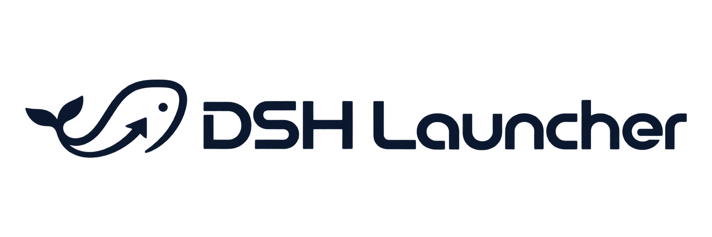

<div align="center">



让 DeepSeek Harness 在 Windows 和 macOS 上更方便地启动和更新。

<p>
  <a href="https://github.com/isunky/DSH-Desktop/actions/workflows/ci.yml"></a>
  <a href="https://github.com/isunky/DSH-Desktop/releases"></a>
</p>

<p>
  <a href="https://github.com/isunky/DSH-Desktop/releases/latest">下载 DSH Launcher</a>
  ·
  <a href="https://github.com/deepseek-ai/deepseek-harness">了解 DeepSeek Harness 官方项目</a>
  ·
  <a href="https://github.com/isunky/DSH-Desktop/issues">反馈问题</a>
</p>

</div>

DSH Launcher 是一个轻量桌面启动器。安装后，它会帮你准备并启动 DSH 核心和本地界面，也可以分别检查 DSH 核心与启动器本身的更新。

## 下载和安装

前往[最新版本下载页](https://github.com/isunky/DSH-Desktop/releases/latest)，在最新版本下选择适合你电脑的安装包：

| 电脑 | 下载文件 | 安装方式 |
| --- | --- | --- |
| Windows 64 位 | 文件名带有 `win-x64` 的 `.exe` 安装包 | 双击安装，按提示完成 |
| Mac，Apple 芯片（M 系列） | 文件名带有 `mac-arm64` 的 `.dmg` | 打开磁盘映像，将应用拖到“应用程序”文件夹 |
| Mac，Intel 芯片 | 文件名带有 `mac-x64` 的 `.dmg` | 打开磁盘映像，将应用拖到“应用程序”文件夹 |

如果不确定 Mac 使用哪种芯片，打开苹果菜单中的“关于本机”：显示“芯片 Apple M…”的是 Apple 芯片；显示“处理器 Intel…”的是 Intel 芯片。

目前 macOS 安装包尚未进行 Apple 开发者签名和公证。首次打开时，macOS 可能会提示无法确认开发者或检查恶意软件。请先确认安装包来自上面的官方发布页；如果仍要继续，先尝试打开应用，再到“系统设置 → 隐私与安全性”选择“仍要打开”并确认。详情见 [Apple 的说明](https://support.apple.com/zh-cn/102445)。

## 第一次启动

首次启动需要联网准备 DSH 运行环境，界面会显示正在处理的步骤和用时。你不需要另外安装 Node.js、pnpm 或 DSH 命令行工具。

启动器会先检查电脑上是否已经有可用的 Node.js 和官方 DSH 核心；符合要求时会直接复用。缺少组件时，启动器会从官方渠道按需下载并保存到本机。准备完成后，DSH 界面会在启动器窗口中打开。

首次准备可能需要一些时间，具体取决于网络速度。启动页面可以取消并退出；如果遇到失败，页面会显示错误信息，并在支持的情况下提供修复重试。Windows 电脑如果尚未安装 WebView2，安装过程需要联网获取它。

运行环境准备完成后，所需组件会在本机复用或缓存。之后启动通常不需要重新下载；已有缓存时，断网也可以启动。首次安装和检查更新需要联网。

## 日常使用和更新

主界面右上角的“…”按钮打开设置。这里可以分别管理两类更新：

- **DSH 核心更新**：检查 DeepSeek 官方发布的核心版本。确认更新后，启动器会更新当前使用的核心。
- **DSH Launcher 更新**：检查本项目的 GitHub Release。启动器会在应用内下载适用于你电脑的安装包；下载完成后，点击“打开安装包”继续安装。

两种更新相互独立。更新启动器不会替你更新 DSH 核心，更新核心也不会替你更新启动器。DSH Launcher 使用单独的用户数据目录，更新程序不会清除其中的聊天和其他数据。以前通过其他方式运行 DSH 保存的数据不会自动搬进这个目录。

## 用户数据保存在哪里

| 系统 | 数据目录 |
| --- | --- |
| Windows | `%LOCALAPPDATA%\DeepSeek Harness\dsh-home\` |
| macOS | `~/Library/Application Support/DeepSeek Harness/dsh-home/` |

此目录由 DSH 保存用户数据。若需要备份，可先退出 DSH Launcher，再复制整个 `dsh-home` 文件夹到安全位置。请勿在 DSH 运行时移动或删除该文件夹。

## 遇到问题

**启动一直停在准备中或下载失败**

首次启动需要访问 Node.js 下载站点和 DeepSeek 官方核心发布渠道。请检查网络后重试。若页面显示“自动修复并重试”，可以点击该按钮；失败详情保存在数据目录上一级的 `startup-error.log`。

**更新后聊天或设置还在吗？**

正常情况下会保留。DSH 用户数据位于上面的 `dsh-home` 文件夹，与启动器和核心更新分开保存。若要重装系统或手动清理数据，请先备份该文件夹。

**安装包从哪里来？**

启动器只从 [DSH Launcher 官方 GitHub Releases](https://github.com/isunky/DSH-Desktop/releases) 获取自身更新。DSH 核心来自 [DeepSeek 官方项目](https://github.com/deepseek-ai/deepseek-harness)的发布渠道。你可以在设置中点击对应仓库链接查看来源和版本说明。

如果问题仍然存在，请到[问题反馈页](https://github.com/isunky/DSH-Desktop/issues)提交问题，并附上系统版本、启动页面显示的错误信息，以及（如存在）`startup-error.log`。提交日志前，请检查其中没有你不希望公开的个人信息。

## 项目说明

DSH Launcher 是社区维护的独立桌面启动器，并非 DeepSeek 官方产品。DeepSeek Harness 的核心程序由 [DeepSeek 官方项目](https://github.com/deepseek-ai/deepseek-harness)发布；本启动器的开发者是 Sunky。

<details>
<summary>面向开发者：构建、测试和上游同步</summary>

### 本地开发

开发构建需要 Node.js 22.19+、pnpm、Rust stable 和平台对应的 C++/Xcode 工具。Windows 可双击仓库根目录的 `Build-Windows.cmd` 构建 Windows x64 安装包；macOS 需要在对应架构的 Mac 上构建。

```sh
git submodule update --init --recursive
corepack enable
pnpm install
pnpm run client:check
pnpm run client:dev
```

Windows 一键构建仅生成安装包，不生成便携版。也可用 `pnpm run client:package:win` 构建 Windows 安装包；macOS 命令见下表。

| 目标 | 命令 |
| --- | --- |
| Windows x64 安装包 | `pnpm run client:package:win` |
| macOS Apple 芯片 | `pnpm run client:package:mac:arm64` |
| macOS Intel | `pnpm run client:package:mac:x64` |

### 上游源码和核心的区别

仓库中的 `upstream/` 是 DeepSeek Harness 官方源码的 Git 子模块，用于维护者跟踪源码版本和检查兼容性。它不会打进客户端安装包。用户实际运行的 DSH 核心从官方 npm 渠道单独安装和更新。维护者同步源码的步骤见 [UPDATE_UPSTREAM.md](UPDATE_UPSTREAM.md)。

### 自动构建与发布

- `Basic CI` 在提交和 Pull Request 时进行源码检查和测试。
- `Version Build` 可按 patch、minor 或 major 自动递增版本，构建 Windows 与 macOS 安装包并发布 GitHub Release。

</details>

<div align="center">

[下载最新版本](https://github.com/isunky/DSH-Desktop/releases/latest) · [反馈问题](https://github.com/isunky/DSH-Desktop/issues)

</div>
