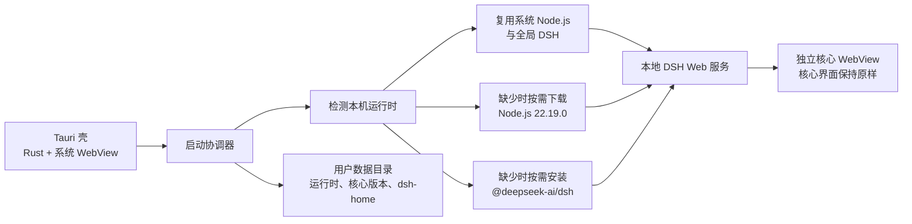

<div align="center">


# DeepSeek Harness Desktop

轻量、跨平台、按需加载的 DeepSeek Harness 独立桌面客户端

<p>
  <a href="https://github.com/isunky/DSH-Desktop/actions/workflows/ci.yml"></a>
  <a href="https://github.com/isunky/DSH-Desktop/releases"></a>
</p>

<p>
  <a href="https://github.com/deepseek-ai/deepseek-harness">上游项目</a>
  ·
  <a href="https://github.com/isunky/DSH-Desktop/releases">下载客户端</a>
  ·
  <a href="https://github.com/isunky/DSH-Desktop/actions">查看构建</a>
</p>

</div>

> [!NOTE]
> 本项目处于预览阶段。桌面安装包只包含 Tauri 壳和启动管理器，不内置 Node.js 或完整 DSH 核心；首次启动会优先检测并复用满足要求的本机 Node.js 与全局官方 DSH，找不到时才按需下载并缓存运行环境。

## 亮点

| 方向 | 说明 |
| --- | --- |
| 轻量桌面壳 | 使用 Tauri + 系统 WebView，避免把完整浏览器运行时打进安装包。 |
| 按需运行时 | 首次启动优先复用兼容的本机 Node.js/全局 DSH；找不到时才下载固定版本 Node.js，并使用 SHA-256 校验。 |
| 核心独立管理 | DSH 核心通过 npm 按需安装，版本目录与用户数据分离，支持保留旧版本。 |
| 沉浸式体验 | 自定义无边框头部、统一窗口控件；核心页面在独立 WebView 中原样运行。 |
| 安静运行 | Windows 启动任务和 DSH 后台进程隐藏控制台窗口，诊断输出仍由客户端接收。 |

## 架构



启动流程如下：

1. Tauri 壳启动自定义头部和启动页；
2. 检查满足 `^22.19.0 || >=24.0.0` 的本机 Node.js，以及全局官方 `@deepseek-ai/dsh`；
3. 验证通过则保存路径绑定并直接使用；否则复用本机 Node.js 安装 DSH，或下载并校验客户端托管的 Node.js；
4. 启动本地 DSH Web 服务，并将核心页面加载到独立 WebView；
5. 已缓存 Node.js 与核心时，可以断网启动。

## 支持平台

| 平台 | 架构 | 打包产物 |
| --- | --- | --- |
| Windows | x64 | NSIS 安装包、便携 ZIP |
| macOS | arm64 | DMG |
| macOS | x64 | DMG |

## 快速开始

### 环境要求

- Node.js `22.19+` 或 `24+`、Corepack/pnpm；
- Rust stable、Cargo；
- Windows 需要 MSVC 工具链，macOS 需要 Xcode Command Line Tools；
- 构建目标为 Windows x64 或 macOS x64/arm64。

首次准备 Tauri CLI：

```sh
cargo install tauri-cli --version 2.11.4 --locked
```

### 开发启动

```sh
git submodule update --init --recursive
corepack enable
pnpm install
pnpm run client:check
pnpm run client:dev
```

首次启动会安装 `client/core-channel.json` 中指定的核心版本；如果本机已有兼容的全局官方 DSH，则会直接复用。也可以先使用开发机 Node.js 检查或安装客户端托管核心：

```sh
pnpm run client:core:check
pnpm run client:core:install
```

启动页会显示准备阶段和耗时。首次安装时间较长时，可以点击取消按钮、按 `Esc` 或直接关闭窗口；客户端会停止安装任务和本地 DSH 服务。

## 本地构建

Windows 用户可在仓库根目录直接双击 `Build-Windows.cmd`。脚本使用 PowerShell 7.2+（`pwsh.exe`），不会回退到 Windows PowerShell 5；随后检查 Node.js、Rust/MSVC 和 Tauri CLI，初始化子模块、安装依赖、运行测试，并生成 Windows x64 安装包。该一键脚本不生成便携版。命令行也可执行：

```powershell
.\Build-Windows.ps1
```

依赖已安装时可跳过 `pnpm install`，调试构建时也可按需跳过检查：

```powershell
.\Build-Windows.ps1 -SkipInstall
.\Build-Windows.ps1 -SkipInstall -SkipChecks
```

| 目标 | 命令 | 产物目录 |
| --- | --- | --- |
| Windows x64 安装包 | `pnpm run client:package:win` | `artifacts/win-x64/` |
| Windows x64 便携目录 | `pnpm run client:package:dir` | `artifacts/dir/` |
| macOS arm64 | `pnpm run client:package:mac:arm64` | `artifacts/mac-arm64/` |
| macOS x64 | `pnpm run client:package:mac:x64` | `artifacts/mac-x64/` |

Windows 便携目录包含 `deepseek-harness.exe` 和 `client/` 运行时资源，可自行压缩分发。安装包和便携目录都不包含 Node.js 或 DSH 核心，目标机首次运行仍会按需下载。

Windows 安装器在目标机缺少 WebView2 时会尝试联网下载引导程序。离线部署时，请预先安装 WebView2，或调整 `src-tauri/tauri.conf.json` 的 WebView 安装策略。

正式发布仍需在对应平台配置代码签名、公证和更新服务。

## 数据与核心更新

默认用户数据目录：

| 平台 | 目录 |
| --- | --- |
| Windows | `%LOCALAPPDATA%/DeepSeek Harness/` |
| macOS | `~/Library/Application Support/DeepSeek Harness/` |

目录结构（系统 DSH 被复用时，核心目录会额外保存外部绑定）：

```text
DeepSeek Harness/
├─ runtime/node/22.19.0/       # 按需下载的 Node.js
├─ core/versions/<version>/    # 按版本保存的 DSH 核心
├─ core/current.json           # 当前使用的核心版本
├─ runtime-binding.json        # 本机 Node.js/全局 DSH 的已验证路径绑定
└─ dsh-home/                   # DSH 用户数据，不随核心更新删除
```

顶部“更多”中的“检查核心更新”会读取 `client/core-channel.json`。复用系统 DSH 时，确认后使用原 Node.js/npm 更新全局官方安装；客户端托管模式则下载新版本、保留旧版本并重启本地核心。核心通道的唯一配置点如下：

```json
{
  "packageName": "@deepseek-ai/dsh",
  "registry": "https://registry.npmjs.org",
  "distTag": "latest",
  "minimumCoreVersion": "0.1.5-rc.1",
  "autoUpdate": false,
  "defaultPort": 3080
}
```

## GitHub Actions

- `Client CI`：在 `main` 推送和 Pull Request 时，校验上游 submodule、Node 脚本、隐藏控制台逻辑、Rust 格式和 Tauri 编译；
- `Release Desktop Client`：推送 `v*` 标签时，分别构建 Windows 安装包/便携 ZIP 和 macOS DMG，并自动发布 GitHub Release；也支持手动触发构建。

发布前请同步修改根目录 `package.json` 与 `src-tauri/tauri.conf.json` 的版本号，然后创建正式标签：

```sh
git tag v0.1.0
git push origin v0.1.0
```

## 仓库结构

```text
.
├─ client/
│  ├─ runtime/                 # Node/DSH 启动与管理脚本
│  ├─ tauri/                   # 启动页、沉浸式头部和图标
│  ├─ core-channel.json        # DSH 核心渠道配置
│  └─ client-info.json         # 客户端与发布信息
├─ src-tauri/
│  ├─ src/main.rs              # Tauri/Rust 壳与进程生命周期
│  ├─ capabilities/            # Tauri 权限配置
│  └─ tauri.conf.json          # 应用与打包配置
├─ scripts/client.mjs          # 开发、检查和打包入口
└─ upstream/                   # DeepSeek Harness 上游 Git submodule
```

## 与上游同步

阅读 [UPDATE_UPSTREAM.md](UPDATE_UPSTREAM.md) 后执行：

```sh
pnpm run client:update-upstream
pnpm run client:check
```

客户端不直接修改 `upstream/`，也不把上游桌面端作为运行时依赖；上游 submodule 用于源码跟踪、版本对照和后续兼容性验证。

## 常见问题

**首次启动为什么较慢？**

首次启动需要访问 Node.js 下载站点和配置的 npm registry。Node.js 与核心完成缓存后，后续启动不再重复下载。

**Windows 上没有看到终端窗口是正常的吗？**

正常。桌面壳会隐藏 Node.js、核心安装任务和本地 DSH 服务的控制台窗口；启动状态与错误信息显示在客户端界面中。

**如何清理本地产物？**

```sh
pnpm run client:clean
```

上游项目：<https://github.com/deepseek-ai/deepseek-harness>

客户端发布页：<https://github.com/isunky/DSH-Desktop/releases>
